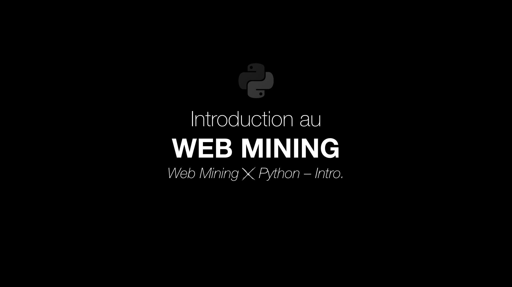
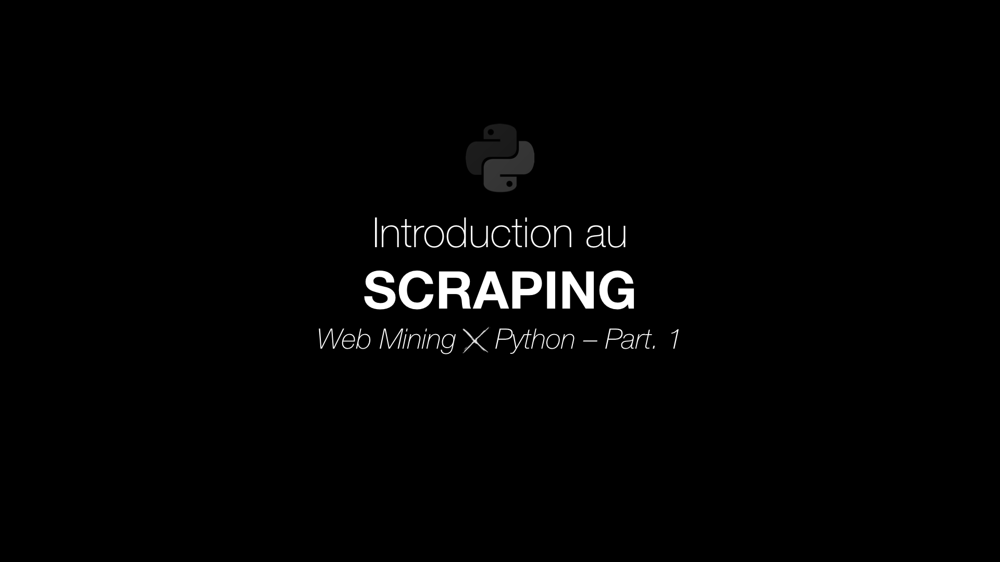
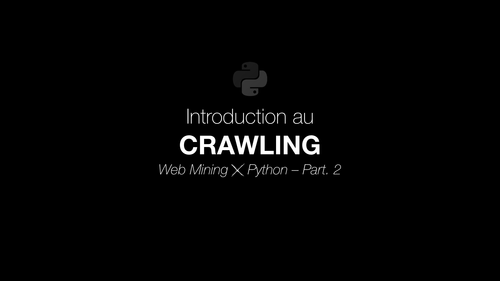

# Web Mining *X* Python

*Ce répertoire vise à introduire à la collecte de données web (Web Mining).*

## Introduction au Web Mining

Le *Web Mining* est une branche spécifique du Data Mining qui s'intéresse aux données issues du web.

Ces données sont très intéressantes pour des problématiques liées au marketing ou aux sciences humaines. En effet, elles permettent de contourner les biais des méthodes expérimentales (préconçus, orientations des questions...) - ou encore le *paradoxe de Labov* - car contrairement aux données recueillies lors de questionnaires/entretiens, les personnes produisent les contenus spontanément.

En Web Mining, on analyse généralement trois types de données :
- Usages du web (parcours utilisateurs, web analytics...)
- Contenus du web (*Scraping*...)
- Structure du web (*Crawling*...)

## La limite des APIs web

Sur la plupart des gros sites web, des *APIs* sont mises à disposition pour pouvoir en récupérer les données. C'est par exemple le cas pour Twitter, Facebook ou Linkedin. Toutefois, certaines de ces APIs sont largement limitées (contenu innaccessible, rate limit, options payantes...). Autre problème, des sites moins importants, mais tout aussi intéressant à analyser, ne possèdent tout simplement pas d'API.
Pour récolter l'ensemble des données qui nous intéressent, il existe une solution puissante qui s'affranchit de ces limites : le *Scraping*.

## Le Scraping

*To scrape*, ou gratter en français, c'est l’art d’extraire des données directement depuis leur représentation visuelle. Lorsqu'on crée une page web, on va structurer son contenu avec du HTML. Du templating va permettre de formater et d'insérer des données dynamiques dans ces structures. Ainsi, dans le cas des pages web, on va scraper le HTML lui-même pour récupérer précisément les données souhaitées. D'une certaine manière, on procède à une rétro-ingénierie du processus de templating.

Pour commencer cette introduction au scraping, assurez-vous d'avoir installer les deux dépendances suivantes :
- `pip install requests`
- `pip install beautifulsoup4`

Maintenant, rendez-vous sur [ce notebook](Introduction%20au%20Scraping.ipynb) pour découvrir le scraping !

## Le Crawling

